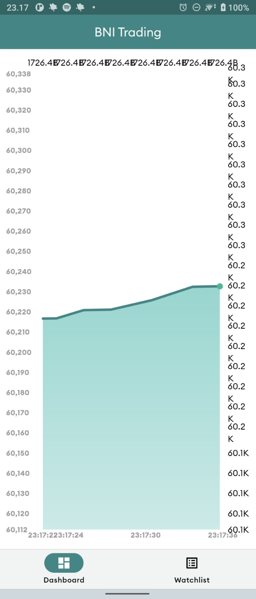

## BNI Trading (Challenge)

This project is a starting point for a Flutter application.

## Installation

__Step 1__

Clone the project

```
git clone https://github.com/x1q2q/bni_trading.git
```

__Step 2__

Get the dependencies package/libraries (this project use Flutter SDK 3.24 & Dart SDK >=3.5.0 < 4.0.0)

```
flutter pub get
```

__Step 3__

Run project

```bash
flutter run
```

## Requirement :
- flutter version : 3.24
- sdk : >=3.5.0 <4.0.0

## Tech stack with (packages) :
- `provider` => State Management
- `web_socket_channel` => StreamChannel wrappers for WebSockets
- `intl`: Date/number formatting and parsing
- `fl_chart`: Chart Visualization

## BNI Trading Challange Code (Bions)

<table>
  <tr>
    <td align="center" valign="center"></td>
  </tr>
  <tr>
    <td align="center" valign="center"></td>
  </tr>
 </table>